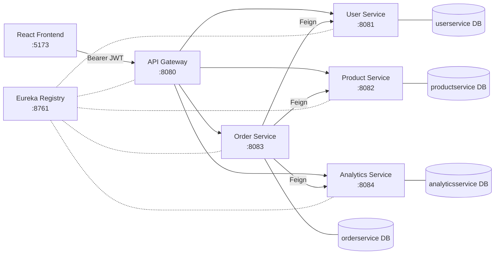

# Microservices Demo

An e-commerce backend built with **Java 21 / Spring Boot** microservices and a **React + TypeScript** frontend, with separate customer and admin areas.

## Architecture

Clients only talk to the **API Gateway**, which validates the JWT and routes requests to the services through **Eureka**. Each service has its own MySQL database.



| Service | Port | Purpose |
|---|---|---|
| APIGateway | 8080 | Entry point: JWT validation, role rules, routing |
| ServiceRegistry | 8761 | Eureka service discovery |
| UserService | 8081 | Register, login, profile, issues JWT |
| ProductService | 8082 | Products, stock, stock history |
| OrderService | 8083 | Create, view and cancel orders |
| AnalyticsService | 8084 | Sales dashboard and reports |
| frontend | 5173 | React web app |

## Tech Stack

- **Backend:** Java 21, Spring Boot, Spring Cloud (Gateway, Eureka, OpenFeign), Spring Security (JWT), Spring Data JPA, MySQL
- **Frontend:** React 19, TypeScript, Vite, Tailwind CSS, TanStack Query, Recharts

## Setup

### Prerequisites

- JDK 21
- Node.js 20+
- MySQL 8 on `localhost:3306`

### 1. Create the databases

```sql
CREATE DATABASE userservice;
CREATE DATABASE productservice;
CREATE DATABASE orderservice;
CREATE DATABASE analyticsservice;
```

Tables are created automatically on first run.

### 2. Set your MySQL credentials

Edit `src/main/resources/application.yaml` in UserService, ProductService, OrderService and AnalyticsService. The defaults are user `root`, password `root123`.

### 3. Start the backend (one terminal each, in this order)

```bash
cd ServiceRegistry  && ./mvnw spring-boot:run   # wait until http://localhost:8761 loads
cd UserService      && ./mvnw spring-boot:run
cd ProductService   && ./mvnw spring-boot:run
cd OrderService     && ./mvnw spring-boot:run
cd AnalyticsService && ./mvnw spring-boot:run
cd APIGateway       && ./mvnw spring-boot:run
```

On Windows, use `mvnw.cmd`.

### 4. Start the frontend

```bash
cd frontend
npm install
npm run dev
```

Open **http://localhost:5173**. The API URL is set in `frontend/.env`:

```
VITE_API_BASE_URL=http://localhost:8080
```

### 5. Create an admin

Registered users get the `USER` role. To get admin access, register an account, then run:

```sql
UPDATE userservice.`user` SET role = 'ADMIN' WHERE email = 'you@example.com';
```

Log in again to receive a new token.

## Project Structure

Backend services share one layout: `controller` (HTTP endpoints) → `service` (business logic) → `repository` (database) → `model` (entities), plus `dto` (request/response bodies) and `exception` (error handling).

```
Microservices-Demo/
├── ServiceRegistry/    # Eureka server, port 8761
├── APIGateway/         # Entry point, JWT and routing, port 8080
├── UserService/        # Users and login, port 8081
├── ProductService/     # Products and stock, port 8082
├── OrderService/       # Orders, port 8083
├── AnalyticsService/   # Sales reports, port 8084
└── frontend/           # React web app, port 5173
```

### ServiceRegistry

Eureka server that all other services register with.

```
ServiceRegistry/                                       # Eureka server (service discovery), port 8761
├── pom.xml                                            # Maven build file and dependencies
├── mvnw, mvnw.cmd, .mvn/                              # Maven wrapper (build without installing Maven)
└── src/
    ├── main/
    │   ├── java/com/example/serviceregistry/
    │   │   └── ServiceRegistryApplication.java        # Starts the Eureka server
    │   └── resources/
    │       └── application.yaml                       # Port 8761, registry does not register itself
    └── test/
        └── java/com/example/serviceregistry/
            └── ServiceRegistryApplicationTests.java   # Default Spring Boot context test
```

### APIGateway

The only service clients call. Validates JWTs, applies role rules and routes requests.

```
APIGateway/                                       # Single entry point for all client requests, port 8080
├── pom.xml                                       # Maven build file and dependencies
├── mvnw, mvnw.cmd, .mvn/                         # Maven wrapper (build without installing Maven)
└── src/
    ├── main/
    │   ├── java/com/example/apigateway/
    │   │   ├── ApiGatewayApplication.java        # Spring Boot entry point
    │   │   └── configuration/
    │   │       ├── GatewayConfiguration.java     # Routes each /xxx-service/** path to its service via Eureka
    │   │       ├── SecurityConfig.java           # Public vs ADMIN-only routes, CORS, JSON 401/403 errors
    │   │       ├── JwtRoleConverter.java         # Maps the JWT "role" claim to ROLE_USER / ROLE_ADMIN
    │   │       ├── UserInfoHeaderFilter.java     # Adds X-User-Email and X-User-Role headers from the JWT
    │   │       └── LoggingFilter.java            # Logs every request with status code and response time
    │   └── resources/
    │       └── application.yaml                  # Port 8080, JWKS URL of UserService, Eureka URL
    └── test/
        └── java/com/example/apigateway/
            └── ApiGatewayApplicationTests.java   # Default Spring Boot context test
```

### UserService

Registration, login, profiles and JWT signing.

```
UserService/                                             # Accounts and authentication, port 8081, DB: userservice
├── pom.xml                                              # Maven build file and dependencies
├── mvnw, mvnw.cmd, .mvn/                                # Maven wrapper (build without installing Maven)
└── src/
    ├── main/
    │   ├── java/com/example/userservice/
    │   │   ├── UserServiceApplication.java              # Spring Boot entry point
    │   │   ├── controller/
    │   │   │   └── UserController.java                  # Endpoints: register, login, get/update/delete user, JWKS
    │   │   ├── service/
    │   │   │   └── UserService.java                     # Register, login, update, delete users and build the JWKS
    │   │   ├── repository/
    │   │   │   └── UserRepository.java                  # Database access: find by email, find by id and email
    │   │   ├── model/
    │   │   │   └── User.java                            # User entity: name, email, hashed password, city, phone, role
    │   │   ├── dto/
    │   │   │   ├── UserRequest.java                     # Register request: name, email, password, city, phone
    │   │   │   ├── UserUpdateRequest.java               # Profile update request: id, name, email, city, phone
    │   │   │   ├── UserResponse.java                    # User data returned to clients (no password)
    │   │   │   ├── LoginRequest.java                    # Login request: email, password
    │   │   │   └── LoginResponse.java                   # Login result: user details plus the JWT
    │   │   ├── exception/
    │   │   │   ├── UserNotFoundException.java           # Thrown when a user does not exist
    │   │   │   ├── DuplicateEmailException.java         # Thrown when the email is already registered
    │   │   │   ├── AuthenticationFailedException.java   # Thrown on wrong email or password
    │   │   │   └── GlobalExceptionHandler.java          # Converts the exceptions above into JSON errors
    │   │   ├── configuration/
    │   │   │   └── SecurityConfig.java                  # BCrypt encoder, authentication manager, stateless sessions
    │   │   └── utils/
    │   │       ├── JwtUtils.java                        # Builds and signs JWTs (24 hour expiry)
    │   │       ├── KeyGeneratorUtils.java               # Generates the RSA key pair used to sign tokens
    │   │       └── CustomUserDetailService.java         # Loads a user by email for Spring Security login
    │   └── resources/
    │       └── application.yaml                         # Port 8081, MySQL connection, Eureka URL
    └── test/
        └── java/com/example/userservice/
            └── UserServiceApplicationTests.java         # Default Spring Boot context test
```

### ProductService

Product catalog, stock levels and stock history.

```
ProductService/                                            # Catalog and inventory, port 8082, DB: productservice
├── pom.xml                                                # Maven build file and dependencies
├── mvnw, mvnw.cmd, .mvn/                                  # Maven wrapper (build without installing Maven)
└── src/
    ├── main/
    │   ├── java/com/example/productservice/
    │   │   ├── ProductServiceApplication.java             # Spring Boot entry point
    │   │   ├── controller/
    │   │   │   └── ProductController.java                 # Endpoints: products, search, stock, history, order and return
    │   │   ├── service/
    │   │   │   └── ProductService.java                    # Product logic; stock changes are done under a row lock
    │   │   ├── repository/
    │   │   │   ├── ProductRepository.java                 # Product queries, keyword search, locked lookup for updates
    │   │   │   └── StockTransactionRepository.java        # Stock history queries
    │   │   ├── model/
    │   │   │   ├── Product.java                           # Product entity: name, category, price, stock, image URL
    │   │   │   ├── StockTransaction.java                  # One row per stock movement
    │   │   │   └── StockTransactionType.java              # Enum: PURCHASE, SALE, RESTOCK, RETURN
    │   │   ├── dto/
    │   │   │   ├── ProductRequest.java                    # Create product: name, category, price, stock, imageUrl
    │   │   │   ├── ProductUpdateRequest.java              # Update product: id, name, category, price, imageUrl
    │   │   │   ├── ProductStockUpdateRequest.java         # Restock request: id, quantity, type
    │   │   │   ├── ProductResponse.java                   # Full product data returned to clients
    │   │   │   ├── ProductSearchResponse.java             # Short result for search: id, name, category
    │   │   │   ├── ProductLowStockResponse.java           # Low-stock report row: id, name, stock
    │   │   │   ├── ProductTransactionResponse.java        # Stock history row: type, quantity, time
    │   │   │   ├── ProductDetails.java                    # One order line: productId and quantity
    │   │   │   └── SalesOrderRequest.java                 # List of order lines sent by OrderService
    │   │   └── exception/
    │   │       ├── ProductNotFoundException.java          # Thrown when a product does not exist
    │   │       ├── ProductOutOfStockException.java        # Thrown when stock is too low
    │   │       ├── IllegalTransactionTypeException.java   # Thrown for a wrong stock transaction type
    │   │       └── GlobalExceptionHandler.java            # Converts the exceptions above into JSON errors
    │   └── resources/
    │       └── application.yaml                           # Port 8082, MySQL connection, Eureka URL
    └── test/
        └── java/com/example/productservice/
            └── ProductServiceApplicationTests.java        # Default Spring Boot context test
```

### OrderService

Creates, fetches and cancels orders, calling the User and Product services.

```
OrderService/                                       # Order processing, port 8083, DB: orderservice
├── pom.xml                                         # Maven build file and dependencies
├── mvnw, mvnw.cmd, .mvn/                           # Maven wrapper (build without installing Maven)
└── src/
    ├── main/
    │   ├── java/com/example/orderservice/
    │   │   ├── OrderServiceApplication.java        # Spring Boot entry point, enables Feign and async
    │   │   ├── controller/
    │   │   │   └── OrderController.java            # Endpoints: create, list, get and cancel orders
    │   │   ├── service/
    │   │   │   ├── OrderService.java               # Order logic; coordinates UserService and ProductService
    │   │   │   └── AnalyticsService.java           # After an order commits, sends sales data to AnalyticsService
    │   │   ├── client/
    │   │   │   ├── UserClient.java                 # Feign client for UserService (fetch user)
    │   │   │   ├── ProductClient.java              # Feign client for ProductService (fetch products, deduct/return stock)
    │   │   │   └── AnalyticsClient.java            # Feign client for AnalyticsService (add/restore sales data)
    │   │   ├── repository/
    │   │   │   ├── OrderRepository.java            # Order queries (for example by user)
    │   │   │   └── OrderItemRepository.java        # Order item queries (by order)
    │   │   ├── model/
    │   │   │   ├── Order.java                      # Order entity: user, total amount, status, created time
    │   │   │   ├── OrderItem.java                  # One product line in an order
    │   │   │   └── OrderStatus.java                # Enum: CREATED, CONFIRMED, CANCELLED
    │   │   ├── dto/
    │   │   │   ├── OrderRequest.java               # Create order request: userId and items
    │   │   │   ├── OrderItemRequest.java           # One requested item: productId, quantity
    │   │   │   ├── OrderResponse.java              # Full order returned to the client, with items
    │   │   │   ├── OrderItemResponse.java          # One order line: product, quantity, price, amount
    │   │   │   ├── OrderDetails.java               # Order summary used in order lists
    │   │   │   ├── OrderConfirmedEvent.java        # Event published when an order is confirmed
    │   │   │   ├── OrderAnalyticsDetails.java      # Order data sent to AnalyticsService
    │   │   │   ├── ProductAnalyticsDetails.java    # Per-product sales data sent to AnalyticsService
    │   │   │   ├── UserResponse.java               # User data received from UserService
    │   │   │   ├── ProductResponse.java            # Product data received from ProductService
    │   │   │   ├── ProductDetails.java             # Order line sent to ProductService
    │   │   │   └── SalesOrderRequest.java          # List of order lines sent to ProductService
    │   │   └── exception/
    │   │       ├── OrderNotFoundException.java     # Thrown when an order does not exist or is not yours
    │   │       ├── OrderProcessingException.java   # Thrown when an order cannot be completed
    │   │       └── GlobalExceptionHandler.java     # Converts the exceptions above into JSON errors
    │   └── resources/
    │       └── application.yaml                    # Port 8083, MySQL connection, Eureka URL
    └── test/
        └── java/com/example/orderservice/
            └── OrderServiceApplicationTests.java   # Default Spring Boot context test
```

### AnalyticsService

Stores sales data and serves dashboard and report data.

```
AnalyticsService/                                       # Sales reporting, port 8084, DB: analyticsservice
├── pom.xml                                             # Maven build file and dependencies
├── mvnw, mvnw.cmd, .mvn/                               # Maven wrapper (build without installing Maven)
└── src/
    ├── main/
    │   ├── java/com/example/analyticsservice/
    │   │   ├── AnalyticsServiceApplication.java        # Spring Boot entry point, enables async
    │   │   ├── controller/
    │   │   │   └── AnalyticsController.java            # Endpoints: add/restore sales, dashboard, trends, reports
    │   │   ├── service/
    │   │   │   ├── AnalyticsService.java               # Stores sales per item and builds all reports
    │   │   │   ├── DailySummaryService.java            # Keeps per-day totals (orders, items, revenue) up to date
    │   │   │   └── FallbackAnalyticsService.java       # Retries the daily summary update when two orders collide
    │   │   ├── repository/
    │   │   │   ├── SalesRecordRepository.java          # Report queries over sales records
    │   │   │   └── DailySummaryRepository.java         # Daily summary lookups by date
    │   │   ├── model/
    │   │   │   ├── SalesRecord.java                    # One row per sold item
    │   │   │   └── DailySummary.java                   # One row per day: orders, items, revenue
    │   │   ├── dto/
    │   │   │   ├── OrderAnalyticsDetails.java          # Order data received from OrderService
    │   │   │   ├── ProductAnalyticsDetails.java        # Per-product sales data received from OrderService
    │   │   │   ├── DashboardData.java                  # Dashboard totals and average order value
    │   │   │   ├── SalesTrendData.java                 # Sales per day for the trend chart
    │   │   │   ├── ProductSalesData.java               # Top products: quantity sold and revenue
    │   │   │   ├── ProductSalesByRange.java            # Product sales for a date range (query result)
    │   │   │   ├── ProductSalesByRangeData.java        # Product sales for a date range (API response)
    │   │   │   ├── RevenueByRange.java                 # Revenue totals for a date range (query result)
    │   │   │   ├── RevenueByRangeData.java             # Revenue totals for a date range (API response)
    │   │   │   ├── SalesDataByCategory.java            # Sales grouped by category
    │   │   │   └── SalesDataByUser.java                # Orders and spend per user
    │   │   └── exception/
    │   │       ├── InvalidTimeRangeException.java      # Thrown for an invalid date range
    │   │       ├── ProductNotFoundException.java       # Thrown when a product has no sales data
    │   │       ├── UserNotFoundException.java          # Thrown when a user has no sales data
    │   │       ├── SalesAnalyticsException.java        # General analytics failure
    │   │       └── GlobalExceptionHandler.java         # Converts the exceptions above into JSON errors
    │   └── resources/
    │       └── application.yaml                        # Port 8084, MySQL connection, Eureka URL
    └── test/
        └── java/com/example/analyticsservice/
            └── AnalyticsServiceApplicationTests.java   # Default Spring Boot context test
```

### frontend

React app with a customer area and an admin area.

```
frontend/                                   # React + TypeScript web app (Vite), port 5173
├── index.html                              # HTML page the app mounts into
├── package.json                            # Dependencies and scripts (dev, build, preview)
├── vite.config.ts                          # Vite config: React, Tailwind, "@" alias for src/
├── tsconfig.json                           # TypeScript config
├── .env                                    # VITE_API_BASE_URL, the gateway address
├── public/
│   ├── favicon.svg                         # Browser tab icon
│   └── icons.svg                           # SVG icon sprite
└── src/
    ├── main.tsx                            # App entry: router, auth, cart and toast providers
    ├── App.tsx                             # All routes: public, customer and admin
    ├── index.css                           # Tailwind import and global styles
    ├── api/
    │   ├── client.ts                       # Shared Axios instance: attaches JWT, redirects to login on 401
    │   ├── authApi.ts                      # Login and register calls
    │   ├── userApi.ts                      # Profile and user management calls
    │   ├── productApi.ts                   # Product, search, stock and transaction calls
    │   ├── orderApi.ts                     # Create, list, get and cancel order calls
    │   └── analyticsApi.ts                 # Dashboard and report calls
    ├── context/
    │   ├── AuthContext.tsx                 # Logged-in user, JWT and role; login/logout (saved in localStorage)
    │   └── CartContext.tsx                 # Shopping cart state (saved in localStorage)
    ├── types/
    │   └── index.ts                        # TypeScript types matching the backend DTOs
    ├── lib/
    │   └── utils.ts                        # Helpers: class merging, currency and date formatting
    ├── components/
    │   ├── ProtectedRoute.tsx              # Route guards: login required, admin role required
    │   ├── CustomerLayout.tsx              # Page frame for customers (navbar + content)
    │   ├── AdminLayout.tsx                 # Page frame for admins (sidebar + content)
    │   ├── Navbar.tsx                      # Top navigation for customers
    │   ├── AdminSidebar.tsx                # Side navigation for the admin area
    │   └── ui/
    │       ├── Button.tsx                  # Reusable button
    │       ├── Input.tsx                   # Reusable text input
    │       ├── Card.tsx                    # Reusable card container
    │       ├── Badge.tsx                   # Small status label
    │       ├── Modal.tsx                   # Popup dialog
    │       ├── EmptyState.tsx              # Placeholder when a list is empty
    │       └── LoadingSpinner.tsx          # Loading indicator
    ├── pages/
    │   ├── LandingPage.tsx                 # Public home page
    │   ├── LoginPage.tsx                   # Login form
    │   ├── RegisterPage.tsx                # Sign-up form
    │   ├── ProductsPage.tsx                # Product listing and search
    │   ├── ProductDetailPage.tsx           # Single product and add to cart
    │   ├── CartPage.tsx                    # Cart contents
    │   ├── CheckoutPage.tsx                # Places the order
    │   ├── OrdersPage.tsx                  # The customer's order history
    │   ├── OrderDetailPage.tsx             # One order, with cancel
    │   ├── ProfilePage.tsx                 # View and edit profile
    │   ├── ForbiddenPage.tsx               # 403 page for non-admins on admin routes
    │   ├── NotFoundPage.tsx                # 404 page
    │   └── admin/
    │       ├── AdminDashboardPage.tsx      # Summary numbers and charts
    │       ├── AdminAnalyticsPage.tsx      # Detailed sales analytics
    │       ├── AdminProductsPage.tsx       # Product list with actions
    │       ├── AdminProductNewPage.tsx     # Create a product
    │       ├── AdminProductEditPage.tsx    # Edit a product
    │       ├── AdminInventoryPage.tsx      # Stock levels, low stock, restocking
    │       ├── AdminTransactionsPage.tsx   # Stock movement history
    │       ├── AdminOrdersPage.tsx         # All orders
    │       ├── AdminOrderDetailPage.tsx    # One order in detail
    │       └── AdminUsersPage.tsx          # All users
    └── vite-env.d.ts                       # Vite type declarations
```
